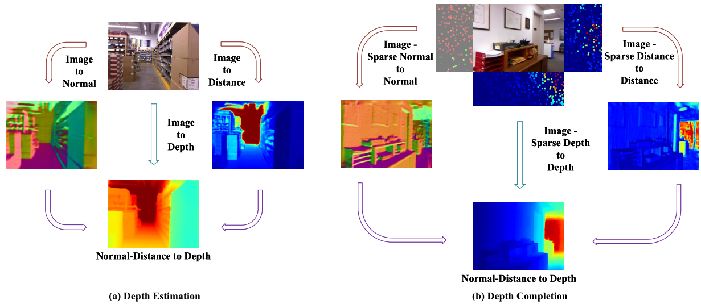

<div align="center">

<h1>NDDepth: Normal-Distance Assisted Monocular Depth Estimation and Completion</h1>

<div>
    <a href='https://scholar.google.com.hk/citations?hl=zh-CN&user=ecZHSVQAAAAJ' target='_blank'>Shuwei Shao</a><sup>1</sup>&emsp;
    <a target='_blank'>Zhongcai Pei</a><sup>1</sup>&emsp;
    <a href='https://scholar.google.com.hk/citations?hl=zh-CN&user=5PoZrcYAAAAJ' target='_blank'>Weihai Chen</a><sup>1</sup></sup>&emsp;
    <a href='https://scholar.google.com.hk/citations?hl=zh-CN&user=7E0QgKUAAAAJ' target='_blank'>Peter C. Y. Chen</a><sup>2</sup>&emsp;
    <a href='https://scholar.google.com.hk/citations?hl=zh-CN&user=LiUX7WQAAAAJ' target='_blank'>Zhengguo Li</a><sup>3</sup>
</div>
<div>
    <sup>1</sup>Beihang University, <sup>2</sup>National University of Singapore, <sup>3</sup>A*STAR
</div>

<div>
    <h4 align="center">
        • <a href="http://arxiv.org/abs/2311.07166" target='_blank'>Extended version</a> •
    </h4>
</div>

<div>
    <h4 align="center">
        • <a href="https://arxiv.org/abs/2309.10592" target='_blank'>Conference version [ICCV 2023(oral)]</a> •
    </h4>
</div>

## Abstract

<div>

</div>

</div>
<strong>We introduce novel physics (geometry)-driven deep learning frameworks for these two tasks by assuming that 3D scenes are constituted with piece-wise planes. Instead of directly estimating the depth map or completing the sparse depth map, we propose to estimate the surface normal and plane-to-origin distance maps or complete the sparse surface normal and distance maps as intermediate outputs. To this end, we develop a normal-distance head that outputs pixel-level surface normal and distance. Meanwhile, the surface normal and distance maps are regularized by a developed plane-aware consistency constraint, which are then transformed into depth maps. Furthermore, we integrate an additional depth head to strengthen the robustness of the proposed frameworks. Extensive experiments on the NYU-Depth-v2, KITTI and SUN RGB-D datasets demonstrate that our method exceeds in performance prior state-of-the-art monocular depth estimation and completion competitors.</strong>

---
This repository will be continuously updated.

## Installation

**Step1**: Creating a virtual environment

```
conda create -n nddepth python=3.8
conda activate nddepth
conda install pytorch=1.10.0 torchvision cudatoolkit=11.1
pip install matplotlib, tqdm, tensorboardX, timm, mmcv, open3d
```

**Step2**: Download [the modified scikit_image package](https://drive.google.com/file/d/1RYOwfdzM6keM3-pkWdydYJjBNSrL6gTJ/view?usp=sharing) , in which the input parameters of the Felzenswalb algorithm have been changed to accommodate our method.

```
unzip scikit-image-0.17.2.zip
cd scikit-image-0.17.2
python setup.py build_ext -i
pip install -e .
``` 

## Datasets
You can prepare the datasets KITTI and NYUv2 according to [here](https://github.com/cleinc/bts/tree/master/pytorch) and download the SUN RGB-D dataset from [here](https://rgbd.cs.princeton.edu/), and then modify the data path in the config files to your dataset locations.

You can download the generated surface normal ground-truth on NYUV2 from [here](https://drive.google.com/file/d/1nITbaVeaEh8JikKV3LK_Vrc67XV9Jkeh/view?usp=drive_link) and KITTI from [here](https://drive.google.com/file/d/1__JhniUkOVaQHft2CXL5ZXqnmf-yUAOa/view?usp=drive_link).

## Training
First download the pretrained encoder backbone from [here](https://github.com/microsoft/Swin-Transformer), and then modify the pretrain path in the config files.  If you want to train the KITTI_Official model, first download the pretrained encoder backbone from [here](https://drive.google.com/file/d/1qjDnMwmEz0k0XWh7GP2aNPGiAjvOPF_5/view?usp=drive_link), which is provided by [MIM](https://github.com/SwinTransformer/MIM-Depth-Estimation).

Training the NYUv2 model:
```
python nddepth/train.py configs/arguments_train_nyu.txt
```

Training the KITTI_Eigen model:
```
python nddepth/train.py configs/arguments_train_kittieigen.txt
```

Training the KITTI_Official model:
```
python nddepth_kittiofficial/train.py configs/arguments_train_kittiofficial.txt
```

## Evaluation
Evaluate the NYUv2 model:
```
python nddepth/eval.py configs/arguments_eval_nyu.txt
```

Evaluate the KITTI_Eigen model:
```
python nddepth/eval.py configs/arguments_eval_kittieigen.txt
```

To generate KITTI Online evaluation data for the KITTI_Official model:
```
python nddepth_kittiofficial/test.py --data_path path to dataset --filenames_file ./data_splits/kitti_official_test.txt --max_depth 80 --checkpoint_path path to pretrained checkpoint  --dataset kitti --do_kb_crop
```

## Qualitative Depth and Point Cloud Results
You can download the qualitative depth results of [NDDepth](https://arxiv.org/abs/2309.10592), [IEBins](https://arxiv.org/abs/2309.14137), [NeWCRFs](https://openaccess.thecvf.com/content/CVPR2022/html/Yuan_Neural_Window_Fully-Connected_CRFs_for_Monocular_Depth_Estimation_CVPR_2022_paper.html), [PixelFormer](https://openaccess.thecvf.com/content/WACV2023/html/Agarwal_Attention_Attention_Everywhere_Monocular_Depth_Prediction_With_Skip_Attention_WACV_2023_paper.html), [AdaBins](https://openaccess.thecvf.com/content/CVPR2021/html/Bhat_AdaBins_Depth_Estimation_Using_Adaptive_Bins_CVPR_2021_paper.html) and [BTS](https://arxiv.org/abs/1907.10326) on the test sets of NYUv2 and KITTI_Eigen from [here](https://pan.baidu.com/s/1zaFe40mwpQ5cvdDlLZRrCQ?pwd=vfxd) and download the qualitative point cloud results of NDDepth, IEBins, NeWCRFS, PixelFormer, AdaBins and BTS on the NYUv2 test set from [here](https://pan.baidu.com/s/1WwpFuPBGBUaSGPEdThJ6Rw?pwd=n9rw). 

If you want to derive these results by yourself, please refer to the test.py.

If you want to perform inference on a single image, run:
```
python nddepth/inference_single_image.py --dataset kitti or nyu --image_path path to image --checkpoint_path path to pretrained checkpoint 
```
Then you can acquire the qualitative depth and normal results.


## Models
| Model | Abs Rel | Sq Rel | RMSE | a1 | a2 | a3| Link|
| ------------ | :---: | :---: | :---: |  :---: |  :---: |  :---: |  :---: |
|NYUv2 (Swin-L) | 0.087 | 0.041 | 0.311 | 0.936 | 0.991 | 0.998 | [[Google]](https://drive.google.com/file/d/1dpDgJZOuso2iBYSXy10K2gneK8c8pFuX/view?usp=drive_link) [[Baidu]](https://pan.baidu.com/s/1M9S3LVGnzoxLAYhcVobmOw?pwd=eo1r)|
|KITTI_Eigen (Swin-L) | 0.050 | 0.141 | 2.025 | 0.978 | 0.998 | 0.999 |[[Google]](https://drive.google.com/file/d/1j3q3JDHn0WKRM3hwHaYqoxHAWoPpIEOb/view?usp=drive_link) [[Baidu]](https://pan.baidu.com/s/1einURP-oxGQQx3BTtVg9bg?pwd=rvvs)|

| Model | SILog| Abs Rel | Sq Rel | RMSE | a1 | a2 | a3| Link|
| ------------ | :---: | :---: | :---: | :---: |  :---: |  :---: |  :---: |  :---: |
|KITTI_Official (Swinv2-L)| 7.53 | 5.23 | 0.81 | 2.34 | 0.972 | 0.996 | 0.999 |[[Google]](https://drive.google.com/file/d/1YGwJcJXwza3thAtzU6oLpINdruiqT_1h/view?usp=drive_link)|

## Citation

If you find our work useful in your research please consider citing our paper:

```
@inproceedings{shao2023nddepth,
  title={NDDepth: Normal-distance assisted monocular depth estimation},
  author={Shao, Shuwei and Pei, Zhongcai and Chen, Weihai and Wu, Xingming and Li, Zhengguo},
  booktitle={Proceedings of the IEEE/CVF International Conference on Computer Vision},
  pages={7931--7940},
  year={2023}
}
```

```
@article{shao2023nddepth,
  title={NDDepth: Normal-Distance Assisted Monocular Depth Estimation and Completion},
  author={Shao, Shuwei and Pei, Zhongcai and Chen, Weihai and Chen, Peter CY and Li, Zhengguo},
  journal={IEEE Transactions on Pattern Analysis and Machine Intelligence},
  year={2024}
}
```

## Contact

If you have any questions, please feel free to contact swshao@buaa.edu.cn.


## Acknowledgement

Our code is based on the implementation of [NeWCRFs](https://github.com/aliyun/NeWCRFs), [BTS](https://github.com/cleinc/bts) and [Structdepth](https://github.com/SJTU-ViSYS/StructDepth). We thank their excellent works.

  
